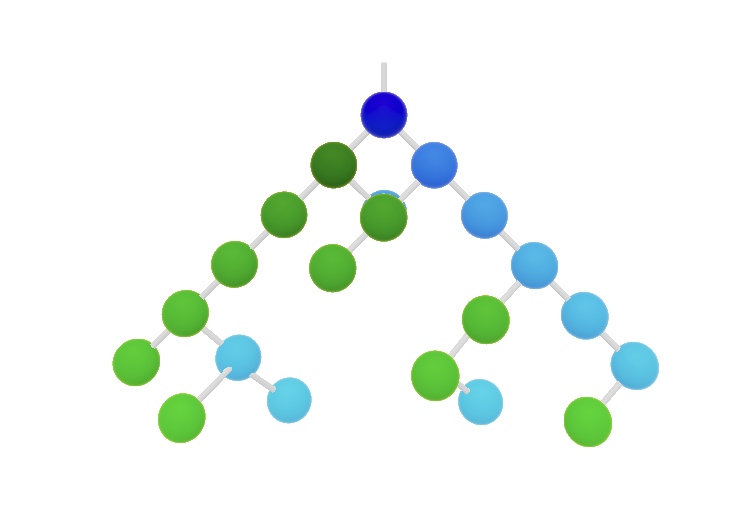

# Getting Started with BiTreemulator App



Binary Tree Simulator


brew install gh
Create new git repository from command line: 
```
git init -b master
gh repo create zombies-sol
git pull --set-upstream origin master
git add . && git commit -m "initial commit" && git push 
```


[](https://app.netlify.com/sites/bitreemulator/deploys)


.
.
.


.
